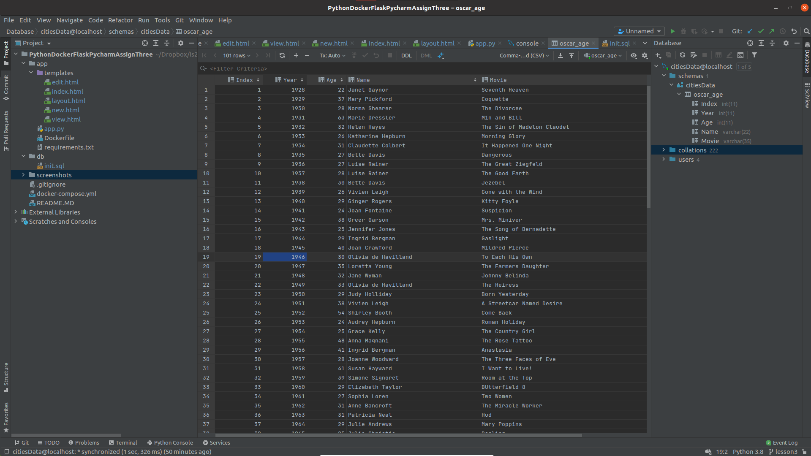
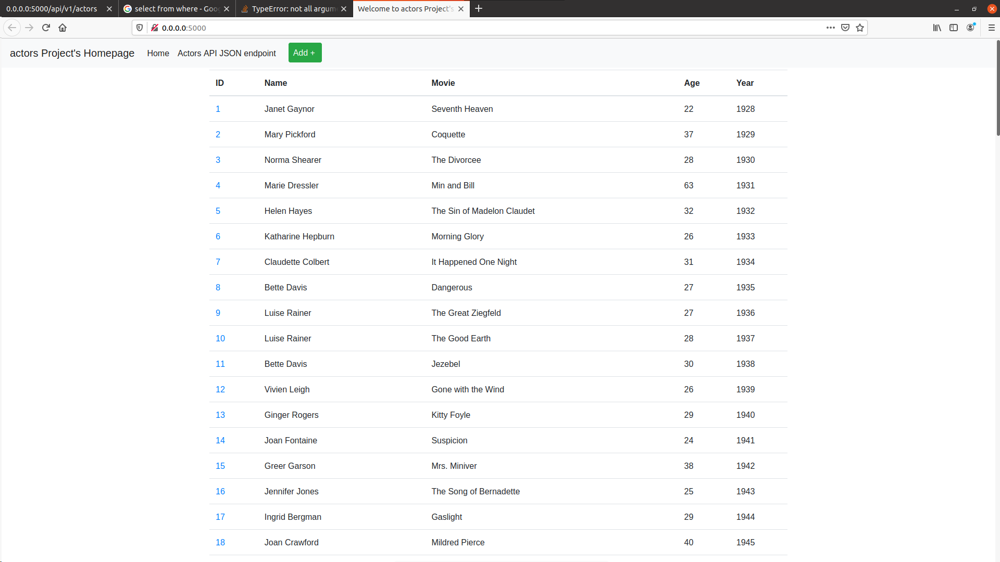
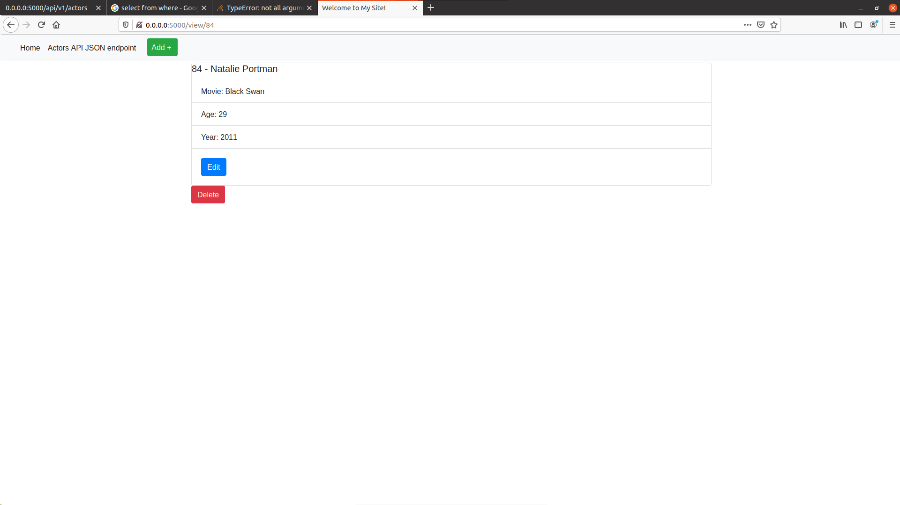
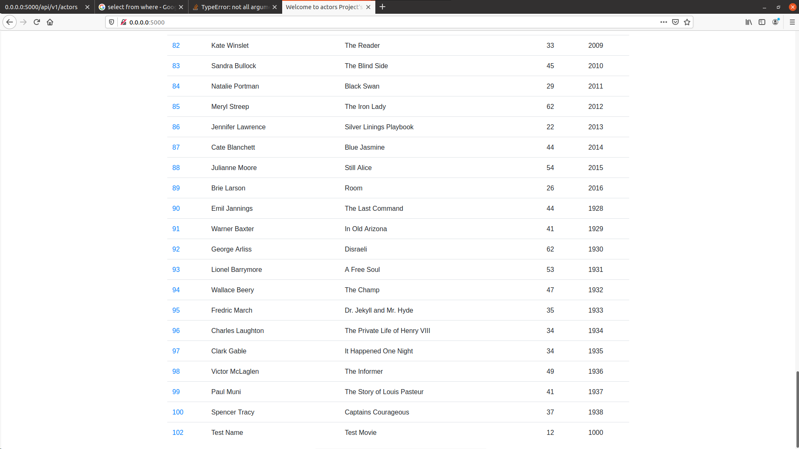
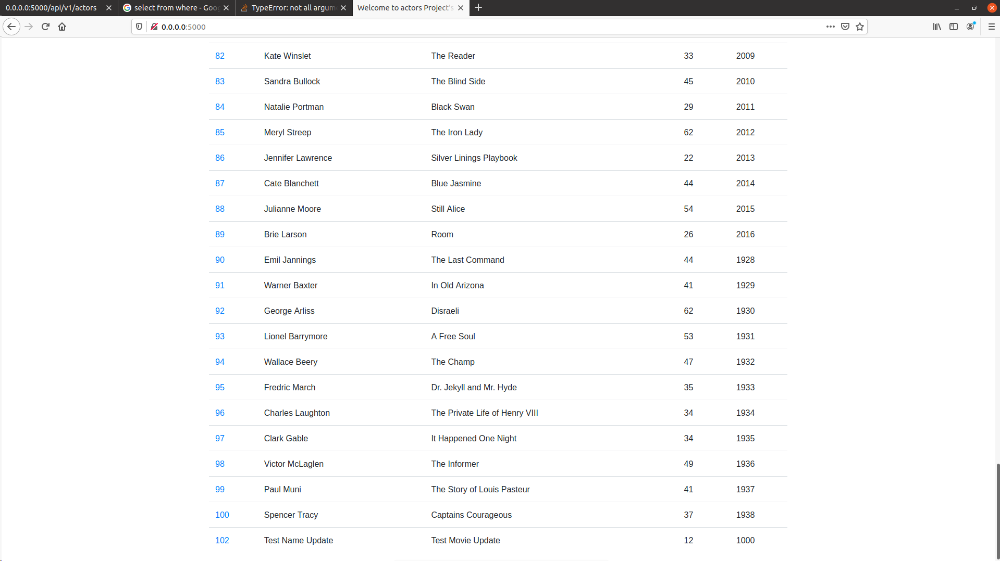
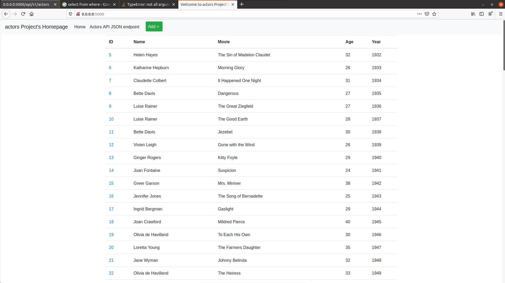

# ScreenShots
### The project showing that you can view YOUR data tables in pycharm 
  
### YOUR project running correctly in the browser displaying your homepage with your data
  
### YOUR project running correctly in the browser displaying your data record as a view of one record
  
### YOUR project running correctly in the browser displaying a new record added to your home page
  
### YOUR project running correctly in the browser displaying an updated record added to your homepage
  
### YOUR project running correctly in the browser displaying a deleted record added to your homepage

