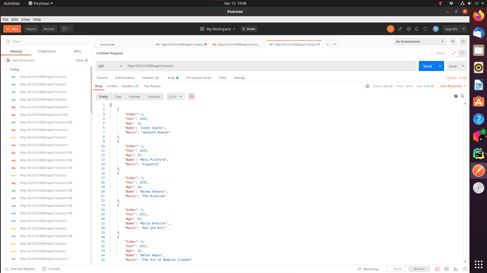

# ScreenShots
### YOUR project showing postman listing all records
  
### YOUR project showing postman showing one record with a get request
  
### YOUR project showing postman creating a record by showing the post request and the results in the record listing
  
### YOUR project showing postman edit a record by showing the put request and the results in the record listing
  
### YOUR project showing postman delete a record by showing the delete request and the results in the record listing
  

